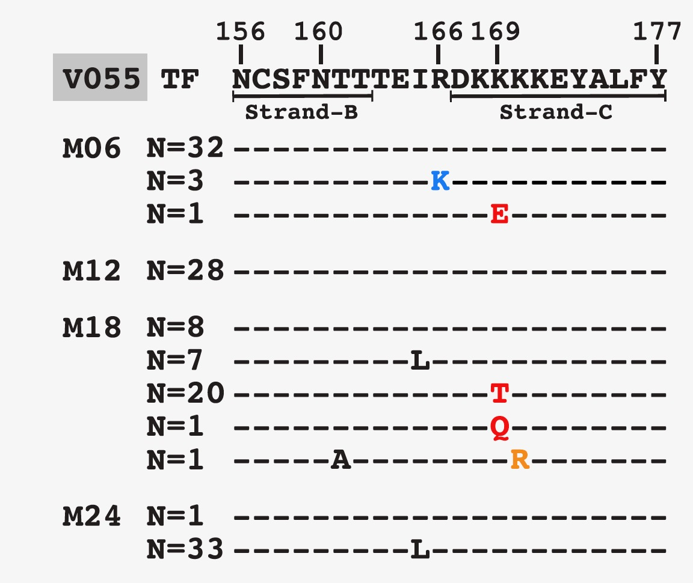
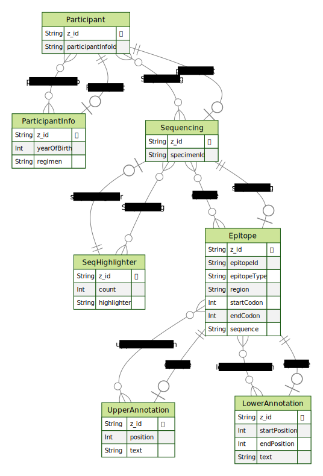

# HIV-1 Broadly neutralising antibodies (bnAbs) reactive epitopes viewer

This app prototype for displaying bNABs epitope data by participant

The following layout was used as a template for displaying data.

Reference: [Bhavna Hora, et al. **Neonatal SHIV infection in rhesus macaques elicited heterologous HIV-1-neutralizing antibodies.**  *Cell Reports.* 2021.](https://pubmed.ncbi.nlm.nih.gov/36924501/)

Data follows the structure below:

## HIV-1 envelope-reactive broadly neutralizing antibody (bnAb) epitopes

| Epitope              | Env location | Residues (amino acids/ regions)                | References                            | epitopeID   |
| -------------------- | ------------ | ---------------------------------------------- | ------------------------------------- | ----------- |
| CD4-binding site     | 276-282      | Loop D; key contacts - PNGS (N\*S/T) N279-280  | West et al, PNAS, 2012                | Loop D      |
| CD4-binding site     | 365-371      | CD4-binding site (bs) loop; key contact - D368 | West et al, PNAS, 2012                | bs loop     |
| CD4-binding site     | 456-469      | V5 loop; key contact – R456                    | West et al, PNAS, 2012                | V5 loop     |
| V2-apex              | 166          | Arginine (R)                                   | Andrabi et al., Immunity, 2015        | V2-apex     |
| V2-apex              | 168-171      | Lysine (K)-rich                                | Haynes et al., Nat Immunol Rev., 2022 | V2-apex     |
| V2-apex              | 156, 160     | PNGS (N\*S/T)                                  | Haynes et al., Nat Immunol Rev., 2022 | V2-apex     |
| V3-glycan            | 301, 332     | PNGS (N\*S/T)                                  | Haynes et al., Nat Immunol Rev., 2022 | V3-glycan   |
| V3-glycan            | 324-327      | GDIR                                           | Haynes et al., Nat Immunol Rev., 2022 | V3-glycan   |
| Gp41 MPER            | 662-667      | ELDKWA                                         | Munir, Haynes, et al. (Duke)          | Gp41-1      |
| Gp41 MPER            | 671-676      | NWFNIT                                         | Munir, Haynes, et al. (Duke)          | Gp41-1      |
| Gp41 fusion peptide  | 512-527      | AVGIGAVFLGFLGAAG                               | Kong et al., Science, 2016            | Gp41-2      |
| Gp120-gp41 interface | 611 (gp41)   | PNGS (N\*S/T)                                  | Falskowka et al., Immunity, 2014      | Interface-1 |
| Gp120-gp41 interface | 637 (gp41)   | PNGS (N\*S/T)                                  | Falskowka et al., Immunity, 2014      | Interface-2 |
| Gp120-gp41 interface | 276 (gp120)  | PNGS (N\*S/T)                                  | Falskowka et al., Immunity, 2014      | Loop D      |
| Gp120-gp41 interface | 448 (gp120)  | PNGS (N\*S/T)                                  | Falskowka et al., Immunity, 2014      | Interface-3 |

**NB**: (1) PNGS – potential N-linked glycosylation site; (2) residues are listed as amino acids

## Installation and running:

1. Ensure your Docker client is running
2. Run the following commands in this directory:

   docker-compose v.1.xx

   `docker-compose build`

   `docker-compose up`

   docker-compose v.2.xx

   `docker compose build`

   `docker compose up`

Note: This does not show changes made to the code without a rebuild.

3. Open a webpage at localhost:3000

## Uninstall

Run the following command in this directory:

docker-compose v.1.xx

`docker-compose down`

docker-compose v.2.xx

`docker compose down`
